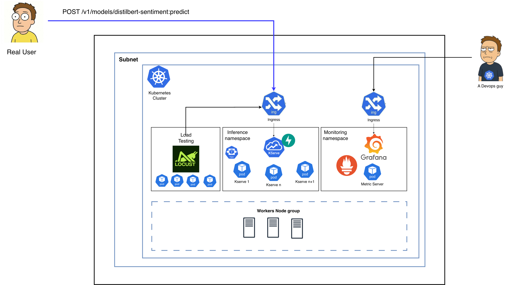
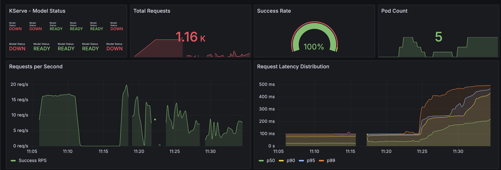
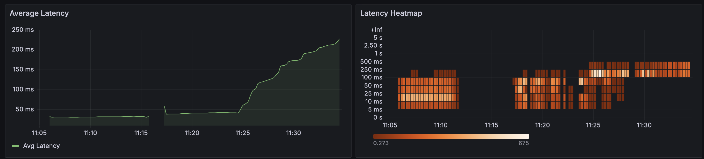
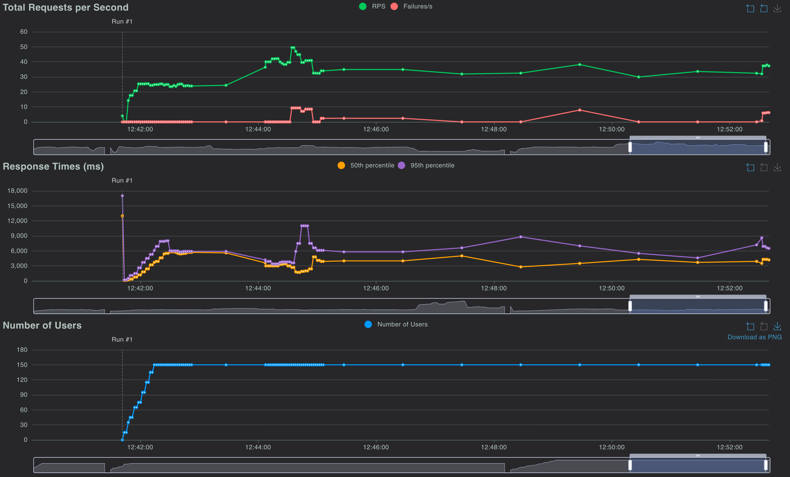

# KServe on EKS — ML Inference Platform

Deploy a KServe-compatible sentiment analysis model on AWS EKS with Karpenter node autoscaling, ALB ingress, Prometheus/Grafana monitoring, and multi-metric HPA.

## Architecture



Users send inference requests (`POST /v1/models/distilbert-sentiment:predict`) through an internet-facing ALB that routes traffic into the EKS cluster. The cluster is organized into three areas:

- **Inference namespace** — KServe sentiment analysis pods running DistilBERT, scaled horizontally by HPA (2–10 replicas). Each pod exposes Prometheus metrics on `/metrics` for latency, throughput, and model status.
- **Load testing** — Locust workers generate synthetic traffic against the inference service from within the cluster, avoiding external network overhead and providing accurate latency measurements.
- **Monitoring namespace** — Prometheus scrapes inference pods and kube-state-metrics, Grafana visualizes dashboards, and prometheus-adapter exposes custom metrics to the Kubernetes metrics API for HPA consumption.

Karpenter manages the worker node group underneath, provisioning GPU or CPU nodes on demand based on pending pod requirements and terminating them when idle.

## Prerequisites

- AWS account with permissions to create VPC, EKS, IAM roles, and EC2 instances
- AWS CLI configured (`aws configure` or environment variables)
- Terraform >= 1.5.7
- `kubectl`
- Docker (for building images)

## Infrastructure Setup

All infrastructure is provisioned and managed through Terraform. The configuration is split into reusable modules (`infra/modules/`) composed in an environment root (`infra/environments/dev/`).

### 1. Configure Terraform Backend

```bash
cp infra/environments/dev/backend.hcl.example infra/environments/dev/backend.hcl
```

Edit `backend.hcl` with your S3 bucket name and region. State locking uses S3 native lockfile — no DynamoDB table is needed (this was deprecated in Terraform 1.10+).

### 2. Deploy Infrastructure

```bash
cd infra/environments/dev
terraform init -backend-config=backend.hcl
terraform plan -out=tfplan
terraform apply tfplan
```

This creates:

| Resource | Details |
|----------|---------|
| **VPC** | 2-AZ layout, public + private subnets, single NAT gateway (dev cost optimization) |
| **EKS cluster** | v1.31, system managed node group (m5.large × 2–4) |
| **Karpenter** | Controller via Helm + Pod Identity, GPU and CPU NodePools with EC2NodeClasses |
| **ALB Controller** | AWS Load Balancer Controller v3.1.0 via IRSA |
| **Metrics Server** | Enables `kubectl top` and HPA resource metrics |
| **NVIDIA Device Plugin** | Exposes `nvidia.com/gpu` as a schedulable resource on GPU nodes |
| **Prometheus Adapter** | Bridges Prometheus metrics into the Kubernetes custom metrics API for HPA |
| **EBS CSI Driver** | EKS managed addon for gp3 PersistentVolumeClaims |

### 3. Deploy Application Stack

Application manifests (deployment, HPA, ingress, monitoring) are applied via the GitHub Actions `deploy.yml` workflow on push to `main`. For manual deployment, use the workflow dispatch trigger with an optional image tag override.

### 4. Verify

```bash
# Configure kubectl
aws eks update-kubeconfig --region us-west-2 --name kserve-inference-dev

# Test inference via ALB
ALB=$(kubectl get ingress inference-ingress -n inference -o jsonpath='{.status.loadBalancer.ingress[0].hostname}')
curl -s "http://$ALB/v1/models/distilbert-sentiment:predict" \
  -H "Content-Type: application/json" \
  -d '{"instances": [{"text": "I love this product!"}]}' | python3 -m json.tool

# Check cluster status
kubectl get pods -n inference
kubectl get hpa -n inference
kubectl get nodes -l karpenter.sh/nodepool
```

## CI/CD Workflows

Both workflows use GitHub OIDC federation to authenticate with AWS — no static access keys are stored.

### Terraform (`terraform.yml`)

Triggered on changes to `infra/` or the workflow file itself. The pipeline runs four stages:

1. **Format check** — `terraform fmt -recursive -check` ensures consistent style
2. **Validate** — `terraform init -backend=false` + `terraform validate` catches syntax and reference errors without needing AWS credentials
3. **Plan** — authenticates to AWS, runs `terraform plan`, posts the output as a PR comment for review, and uploads the plan as an artifact
4. **Apply** — runs only on `main` branch pushes, requires `production` environment approval gate, downloads the plan artifact and applies it

### Build & Deploy (`deploy.yml`)

Triggered on changes to `app/` or `k8s/`. Handles the full application lifecycle:

1. **Build** — builds the Docker image with BuildKit caching, pushes to ECR with a SHA-based tag
2. **Validate manifests** — runs `kubeval` against all K8s YAML files
3. **Deploy** — applies manifests in order (storage class → monitoring → deployment → HPA → load test → ingress), updates the image tag, and waits for rollout completion

Supports `workflow_dispatch` with an `image_tag` input to deploy a specific version without rebuilding.

**Required secret:** `AWS_ROLE_ARN` — the IAM role ARN configured for GitHub OIDC federation.

## Ingress Layer

All services are exposed through a single ALB using the AWS Load Balancer Controller. Three `Ingress` resources share one ALB via the `alb.ingress.kubernetes.io/group.name: kserve-platform` annotation, which avoids provisioning separate load balancers per service.

| Path | Service | Namespace | Notes |
|------|---------|-----------|-------|
| `/v1/*`, `/healthz`, `/ready`, `/metrics` | kserve-sentiment:8080 | inference | Inference API + health/metrics endpoints |
| `/grafana/*` | grafana:3000 | monitoring | Grafana configured with `GF_SERVER_SERVE_FROM_SUB_PATH=true` |
| `/locust/*` | locust:8089 | inference | Load testing UI |

The ALB is configured with a 120s idle timeout to handle slow cold-start inference requests. Health checks target `/healthz` with a 15s interval.

**Production hardening:**

```yaml
annotations:
  # TLS termination at ALB
  alb.ingress.kubernetes.io/certificate-arn: arn:aws:acm:us-west-2:ACCOUNT:certificate/CERT-ID
  alb.ingress.kubernetes.io/listen-ports: '[{"HTTPS":443}]'
  alb.ingress.kubernetes.io/ssl-redirect: "443"
  # Restrict monitoring/load-test access
  alb.ingress.kubernetes.io/inbound-cidrs: "10.0.0.0/8"
```

## Autoscaling

Autoscaling operates at two layers: HPA scales pods within existing nodes, and Karpenter provisions/deprovisions nodes when pod scheduling pressure changes.

### Pod Autoscaling (HPA)

The HPA scales the inference deployment from 2 to 10 replicas based on four signals. The highest metric "wins" — if any single metric exceeds its target, scale-up is triggered.

| Metric | Target | Source | Why |
|--------|--------|--------|-----|
| CPU utilization | 65% | metrics-server | Primary signal for compute-bound inference |
| Memory utilization | 75% | metrics-server | Catches OOM pressure from large batch requests |
| Inference latency (avg) | 500ms/pod | prometheus-adapter | Latency degradation indicates saturation before CPU spikes |
| Request throughput | 50 RPS/pod | prometheus-adapter | Proactive scaling before latency degrades |

**Scaling behavior:**

- **Scale-up:** aggressive — up to 3 pods per minute or 100% of current count (whichever is smaller), with a 30s stabilization window. This ensures fast response to traffic spikes.
- **Scale-down:** conservative — 1 pod every 2 minutes, with a 5-minute stabilization window. This prevents flapping during intermittent traffic dips and avoids unnecessary model cold starts.

Custom metrics (latency and RPS) flow through this pipeline: inference pods → Prometheus scrape → prometheus-adapter → Kubernetes custom metrics API → HPA controller.

### Node Autoscaling (Karpenter)

Karpenter watches for unschedulable pods and provisions right-sized nodes within seconds. Two NodePools handle different workload profiles:

**GPU Inference (`gpu-inference`)** — optimized for uninterrupted GPU workloads:

| Setting | Value | Rationale |
|---------|-------|-----------|
| Instance types | g5.xlarge, g5.2xlarge, g6.xlarge, g6.2xlarge | g5 (A10G) and g6 (L4) are cost-effective for inference |
| Capacity type | **on-demand only** | Spot can be reclaimed with 2 min notice — not enough for GPU model loading (30–60s) |
| Taint | `nvidia.com/gpu=true:NoSchedule` | Prevents non-GPU workloads from landing on expensive GPU nodes |
| GPU limit | 4 | Caps spend in dev |
| Consolidation | `WhenEmpty`, 5 min delay | Never evicts running pods; waits 5 min after last pod drains before terminating |
| Volume | 100Gi gp3, encrypted | Space for NVIDIA drivers + model artifacts |

**CPU Inference (`cpu-inference`)** — cost-optimized for lightweight models:

| Setting | Value | Rationale |
|---------|-------|-----------|
| Instance types | m5, m6i, c5 (xlarge/2xlarge) | Balanced and compute-optimized options for CPU inference |
| Capacity type | spot + on-demand | CPU models (like DistilBERT) load in seconds, so spot interruptions are acceptable |
| Limits | 64 vCPU, 256Gi memory | Caps total capacity in dev |
| Consolidation | `WhenEmptyOrUnderutilized`, 2 min delay | Aggressively bin-packs pods onto fewer nodes to save cost |
| Volume | 50Gi gp3, encrypted | Smaller — no GPU drivers needed |

Karpenter configs live in `k8s/karpenter/` as documented YAML files. EC2NodeClasses use `templatefile()` for cluster-specific values (cluster name, IAM role); NodePools are static.

## Monitoring

Prometheus scrapes inference pods (via `prometheus.io/scrape` annotations), kube-state-metrics (for pod/node status), cAdvisor (for container resource usage), and optionally NVIDIA DCGM exporter (for GPU utilization). Data is stored on a 20Gi gp3 PVC with 15-day retention.

Grafana ships with a pre-built KServe dashboard that tracks model status, total requests, success rate, pod count, RPS, and latency percentiles (p50/p90/p95/p99):



Dedicated latency panels show average latency over time and a heatmap of request duration distribution. The heatmap is particularly useful for identifying bimodal latency patterns — for example, cache hits vs. cold inference:



## Load Testing

Locust runs as an in-cluster deployment in the inference namespace, targeting the KServe service directly (`http://kserve-sentiment:8080`). This eliminates ALB and external network latency from measurements, giving accurate pod-level performance data.

The Locust UI shows three key views: total RPS with failure rate, response time percentiles (p50/p95), and concurrent user ramp-up:



The load test configuration (`load-test/locustfile.py`) sends randomized sentiment analysis requests to exercise the full inference pipeline. Locust runs on system nodes (not inference nodes) to avoid competing for resources with the model.

## Preventing Inference Interruptions

Six design decisions work together to ensure zero-downtime inference:

1. **GPU nodes are on-demand only** — spot instances can be reclaimed with 2 min notice, which is not enough time to gracefully drain a GPU model (loading alone takes 30–60s). The `gpu-inference` NodePool restricts capacity type to `on-demand`.

2. **PodDisruptionBudget** — `minAvailable: 1` ensures at least one inference pod remains running during voluntary disruptions (node drains, cluster upgrades, Karpenter consolidation).

3. **Karpenter `consolidationPolicy: WhenEmpty`** on the GPU pool — Karpenter will never consolidate a node that still has running pods. It only terminates a node after all pods have drained, and waits 5 additional minutes before doing so.

4. **`maxUnavailable: 0`** on rolling updates — during deployments, new pods must pass readiness checks before any old pods are terminated. This prevents capacity dips during image updates.

5. **`preStop` hook with 15s sleep** — when a pod receives SIGTERM, it sleeps 15s before shutting down. This gives the Kubernetes endpoints controller time to remove the pod from the Service, allowing in-flight requests to complete.

6. **Topology spread constraints** — pods spread across availability zones and hosts (`maxSkew: 1`), so a single node or AZ failure doesn't take down all replicas simultaneously.

## Project Structure

```
├── .github/workflows/
│   ├── terraform.yml              # Infra CI/CD (fmt → validate → plan → apply)
│   └── deploy.yml                 # App CI/CD (build → validate → deploy)
├── app/
│   ├── Dockerfile                 # Python 3.11, DistilBERT baked into image
│   └── app.py                     # FastAPI server implementing KServe V1 protocol
├── infra/
│   ├── environments/dev/          # Dev environment root module
│   │   ├── main.tf                # Composes VPC + EKS + Karpenter + addons
│   │   ├── variables.tf
│   │   ├── outputs.tf
│   │   ├── versions.tf            # Provider config (AWS ~> 6.0) + S3 backend
│   │   └── terraform.tfvars
│   └── modules/
│       ├── vpc/                   # VPC with EKS/ALB/Karpenter subnet tags
│       ├── eks/                   # EKS cluster (v1.31) + system node group
│       ├── karpenter/             # Karpenter controller via Helm + Pod Identity
│       └── addons/                # ALB controller, metrics-server, NVIDIA plugin, prometheus-adapter
├── k8s/
│   ├── deployment.yaml            # Inference Deployment + Service + PDB
│   ├── hpa.yaml                   # Multi-metric HPA (CPU, memory, latency, RPS)
│   ├── ingress.yaml               # ALB Ingress (3 resources, 1 ALB via group merging)
│   ├── load-test.yaml             # Locust deployment
│   ├── storage-class.yaml         # gp3 StorageClass for EBS CSI
│   ├── karpenter/
│   │   ├── gpu-node-class.yaml    # EC2NodeClass for GPU nodes (templatefile)
│   │   ├── cpu-node-class.yaml    # EC2NodeClass for CPU nodes (templatefile)
│   │   ├── gpu-nodepool.yaml      # NodePool — on-demand, WhenEmpty consolidation
│   │   └── cpu-nodepool.yaml      # NodePool — spot+od, WhenEmptyOrUnderutilized
│   └── monitoring/
│       ├── prometheus.yaml        # Prometheus + kube-state-metrics (PVC-backed)
│       ├── grafana.yaml           # Grafana with K8s Secret credentials + PVC
│       └── kserve-dashboard.json  # Pre-built Grafana dashboard
├── docs/img/                      # Architecture and dashboard screenshots
└── load-test/
    └── locustfile.py              # Locust load test for KServe inference
```
